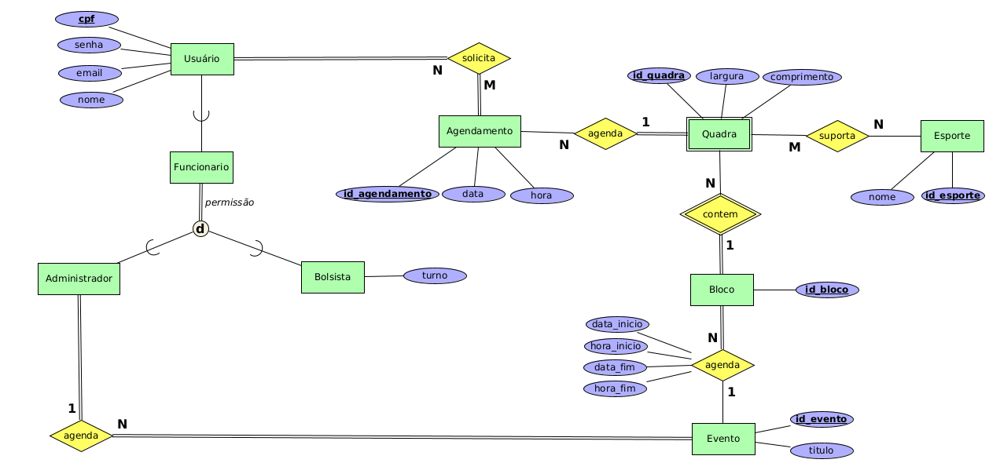

# Quadras

Sistema de agendamento de quadras. Feito usando Flask,
WTForms, SQLAlchemy e Postgresql.

### Algumas Regras de Negócio que Foram Modeladas

* Quadras comportam alguns esportes;
* Blocos são grupos de quadas, por exemplo, um ginásio pode ter duas ou mais quadras;
* Eventos tem data de início data de término, hora de início e hora de término;
* Agendamentos não podem ser marcados em Blocos onde há eventos ocorrendo.

## Aquivos

* **quadrasER.png** diagrama entidade relacionamento
* **quadrasREL.txt** mapeamento relacional das tabelas
* **quadras.sql** criação das tabelas do banco de dados
* **quadras_triggers.sql** criação das funções e triggers do DB

## Modelagem

### Diagrama Entidade Relacionamento


### Modelagem Relacional

```

Usuario(#cpf, senha, email, nome, permissao)
permissao ["adm", "bolsista", "usuario"]

Bolsista(#cpf, turno)
cpf referencia Usuario

Agendamento(#id_agendamento, data, hora)

Bloco(#id_bloco)

Quadra(#id_quadra, largura, comprimento, &id_bloco)
id_bloco referencia Bloco

Esporte(#id_esporte, nome)

QuadraEsporte(#&id_esporte, #&id_quadra)
id_esporte referencia Esporte
id_quadra referencia Quadra

Evento(#id_evento, titulo, data_inicio, data_fim, hora_inicio, hora_fim)

EventoBloco(#&id_evento, @&id_bloco)
id_evento referencia Evento
id_bloco referencia Bloco

```
